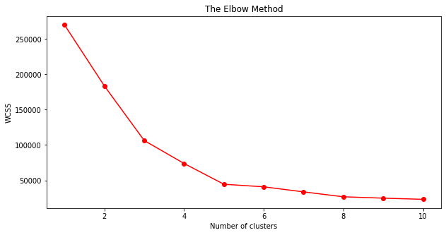
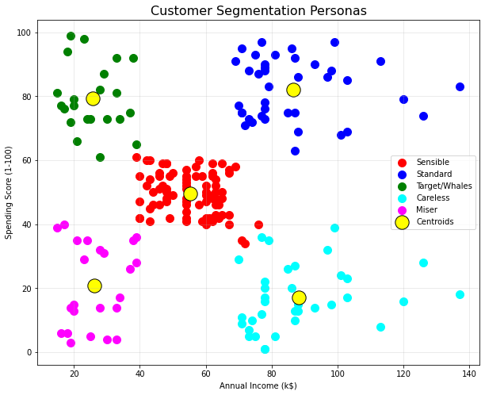

# 🛍️ Customer Segmentation using K-Means Clustering

## 📌 Project Overview
This project applies **Unsupervised Machine Learning** to segment retail customers based on their purchasing behavior. By analyzing annual income and spending patterns, I identified five distinct customer "personas," enabling businesses to transition from mass marketing to highly personalized, data-driven strategies.

## 🛠️ Tech Stack
* **Language:** Python
* **Libraries:** Scikit-Learn, Pandas, Matplotlib, Seaborn
* **Algorithm:** K-Means Clustering

## 🔍 Technical Workflow
* **Data Source:** Mall Customer Segmentation dataset (Local .csv).
* **Feature Selection:** Focused on `Annual Income (k$)` and `Spending Score (1-100)` to map behavioral segments.
* **Optimization:** Implemented the `k-means++` initialization method to ensure faster convergence and avoid suboptimal clustering.

---

## 📊 Visual Analysis (Click to Expand)

<b>1. Determining Optimal Clusters (The Elbow Method)</b>

 

To find the mathematical "sweet spot" for the number of clusters, I calculated the **Within-Cluster Sum of Squares (WCSS)** for 1 to 10 clusters. 

**Analysis:** The "elbow" clearly forms at **k=5**, indicating that adding more clusters beyond this point provides diminishing returns in explaining data variance.

<b>2. Customer Persona Visualization</b>

 

The final model successfully grouped 200 customers into five behavioral segments.

**Strategic Personas Identified:**
* **🔴 Sensible:** High Income, Low Spending (Target for high-value savings/investments).
* **🔵 Standard:** Average Income, Average Spending (The stable core customer base).
* **🟢 Target/Whales:** High Income, High Spending (Primary targets for luxury loyalty programs).
* **🟡 Careless:** Low Income, High Spending (High-engagement, impulse buyers).
* **🟣 Miser:** Low Income, Low Spending (Highly price-sensitive shoppers).

---
